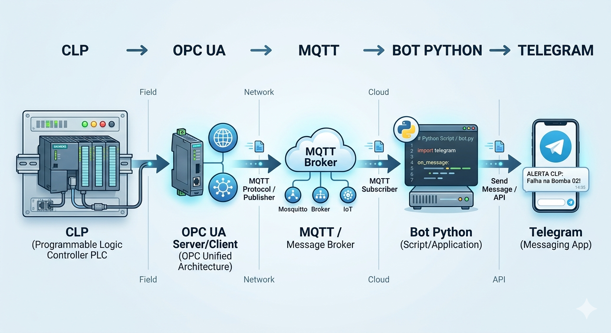
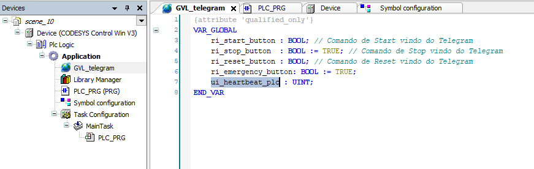
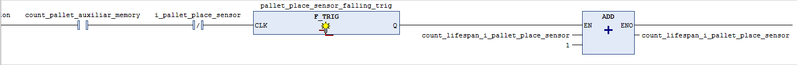
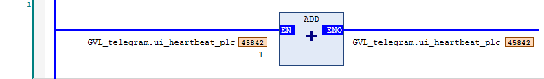
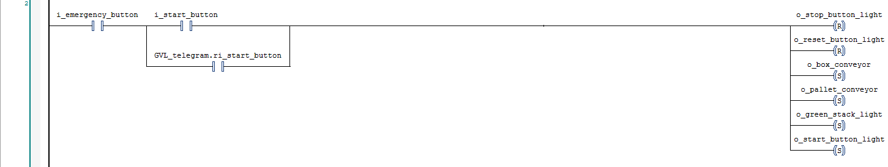

# 🏭 Sistema de Monitoramento Industrial (TelemetriaPyBot)

<div align='justify'>
Middleware industrial de alto desempenho para monitoramento em tempo real, realizando a integração entre CLPs (<strong>via OPC UA</strong>) e brokers MQTT, com interface de controle via Telegram e sistema de dashboards visuais. A finalidade desse projeto é criar soluções na área da automação industrial cuja finalidade seja o foco na indústria 4.0.<br/><br/>

<div align='center' style="background:linear-gradient(135deg, #2c3e50, #7f8c8d); padding:5px;"></div>
</div>

## Sumário

- [Introdução]()
- [Arquitetura do Projeto]()
  - [Fluxo de Monitoramento (Leitura)]()
  - [Fluxo de Comando (Escrita)]()
- [Arquitetura de Execução]()
- [Configuração da Arquitetura]()
  - [Configuração do Ambiente de Desenvolvimento]()
    - [1. Pré-requisitos do Sistema]()
    - [2. Instalação de Dependências]()
    - [3. Estrutura de Pastas e Configuração]()
  - [Orquestração via YAML]()
    - [Conexões de rede]()
    - [Monitoramento de sensores/atuadores]()
    - [Comandos Remotos]()
    - [Regras de alertas]()
    - [Monitoramento do Tempo de Vida Útil]()
    - [Conexões e Credenciais (Telegram & E-mail)]()
    - [Visualização dos dados (Dashboard)]()
  - [Configuração do Ambiente de Automação]()
- [Interface de Operação (Bot Telegram v1.0.0)]()
  - [Comandos Públicos]()
  - [Comandos de Administrador (Nível Privilegiado)]()
- [Conclusão e Próximos Passos]()

## Introdução

<div align='justify'>
<p>Com o avançar dos anos, novas tecnologias vem surgindo em todas as áreas. Na área da automação industrial não seria diferente. Essas novas vem gerando integrações para as mais diferentes áreas. Falando especificamente na área industrial, a integração vem com a área da tecnologia da informação (TI), formando a indústria 4.0 cuja visão é a utilização dos dados gerados pelos sensores para criação das mais diversas soluções. Com isso em mente, surgiu a ideia de criar um bot (robô - <i>robot</i> - em inglês) para fazer o monitoramento dos sensores/atuadores presentes dentro da programação de um CLP, assim como acionar comandos nos sensores/atuadores. Com o intuito de agregar o monitoramento, também foi feito um código para a geração de um dashboard dinâmico para um acompanhamento visual dos dados de monitoramento. Abaixo, explicarei como foi feito toda a estrutura das criações acima citadas.</p>
</div>

## 🏗️ Arquitetura do Projeto

<div align='justify'>
<p>O sistema foi desenhado seguindo o princípio de desacoplamento, garantindo que cada etapa da transmissão de dados seja independente e reaproveitável.</p>
</div>

### 1. 🔄 Fluxo de Monitoramento (Leitura)

<div align='justify'>
  <p>Para evitar a sobrecarga do servidor OPC UA, utilizamos o protocolo MQTT como ponte de dados:
  </p>

  <div align='center'></div><br/>
  
  <p>
      Para garantir a eficiência do sistema e evitar a sobrecarga do servidor industrial, o fluxo de dados de leitura segue uma arquitetura desacoplada:
  </p>

  <ul>
    <li>
      <strong>OPC UA:</strong> O cliente Python estabelece a conexão com o servidor do CLP e realiza a extração dos nomes e valores das variáveis contidas nos arquivos <strong>POUs</strong> (Program Organization Units).
    </li>
    <br>
    <li>
      <strong>MQTT (Publisher):</strong> Os dados coletados são publicados em tópicos específicos (ex: <code>clp/sensor/temperatura_forno</code>). Essa estratégia permite que o servidor OPC UA foque exclusivamente na coleta, delegando ao <strong>Broker MQTT</strong> a responsabilidade de gerenciar a distribuição das mensagens de forma leve e escalável.
    </li>
    <br>
    <li>
      <strong>Bot Python (Receiver):</strong> O bot atua como destinatário, inscrevendo-se nos tópicos configurados. Ao receber os valores, ele processa a formatação da informação e realiza o envio direto para o grupo monitorado no <strong>Telegram</strong>.
    </li>
  </ul>
</div>

### 2. ⚡ Fluxo de Comando (Escrita)

<div align='justify'>
<p>
    Para ações de controle e intervenção remota, o sistema utiliza um caminho direto, eliminando intermediários para garantir a menor latência possível:
  </p>
  
  <p style="text-align: center;">
    <strong>Telegram ➔ Bot Python ➔ OPC UA ➔ CLP</strong>
  </p>

  <ul>
    <li>
      <strong>Processamento e Validação:</strong> O bot recebe o comando enviado via Telegram e realiza uma validação interna de permissão do usuário (verificando se o ID consta na lista de administradores).
    </li>
    <br>
    <li>
      <strong>Execução Direta:</strong> Uma vez validado, o bot escreve o valor diretamente através do <strong>Cliente OPC UA</strong>. Este, por sua vez, altera o estado da variável no CLP em tempo real.
    </li>
    <br>
    <li>
      <strong>Escopo de Variáveis:</strong> Este fluxo é otimizado para variáveis digitais (booleanas), como comandos de ligar/desligar, reset de contadores ou acionamento de botões de emergência, mas também suporta a alteração de valores analógicos (inteiros/reais) conforme a configuração.
    </li>
  </ul>
</div>

### 3. 📊 Visualização do Monitoramento

<div align='justify'>
  <div align='center' style="background:linear-gradient(135deg, #2c3e50, #7f8c8d); padding:1px;"></div><br/>

  <p>Para visualizar os dados em tempo real, o sistema usou o caminho da seguinte forma:
  </p>

  <p style="text-align: center;">
  <strong>CLP ➔ OPC UA ➔ Dashboard</strong>
  </p>
  
  <ul>
    <li>
      <strong>OPC UA:</strong> O cliente Python conecta-se ao servidor do CLP e extrai nomes e valores das variáveis presentes no(s) arquivo(s) POU(s) para serem utilizados nos gráficos do dashboard interativo.
    </li>
  </ul>
</div>

## 🚀 Arquitetura de Execução
<div align='justify'>
  <p>
    O sistema foi projetado de forma modular, aplicando o princípio de separação de preocupações (<em>Separation of Concerns</em>). Isso permite que cada componente opere de forma independente, aumentando a escalabilidade e a facilidade de manutenção:
  </p>

  <ol>
    <li>
      <strong>TelemetriaPyBot (<code>bot_main.py</code>):</strong> Atua como o núcleo operacional, sendo responsável pela conexão persistente com o CLP via <strong>OPC UA</strong>, pela gestão lógica de alertas através do broker <strong>MQTT</strong> e pelo processamento da interface de comandos via <strong>Telegram</strong>.
    </li>
    <br>
    <li>
      <strong>Dashboard Engine (<code>dashboard_main.py</code>):</strong> Opera como um serviço independente e dedicado à camada de visualização. Ele acessa os dados processados para gerar gráficos dinâmicos e relatórios visuais de desempenho.
    </li>
  </ol>

  <p>
    <strong>📍 Ponto Central de Configuração:</strong> Ambos os serviços são orquestrados a partir da pasta <code>/config</code>. Por padrão, eles podem compartilhar o <strong>mesmo arquivo</strong> <code>config.yaml</code> para garantir a sincronização total de variáveis e tópicos. No entanto, o sistema é flexível o suficiente para permitir o uso de arquivos de configuração .yaml distintos, caso haja necessidades específicas para cada serviço.
  </p>
</div>

## 🛠️ Configuração da Arquitetura
<div align='justify'>Abaixo irei mostrar como configurar, ou criar, o ambiente que foi feito no meu computador para que, tanto o monitoramento quanto o dashboard dinâmico, funcione perfeitamente em qualquer outra máquina. Vale ressaltar que o CLP, seja físico ou virtual, precisa estar habilitado para o protocolo <strong>OPC UA</strong>. Certifique isso antes de continuar com a configuração abaixo.</div>

### 🔧 Configuração do Ambiente de Desenvolvimento
<div align='justify'>
  <p>
    Para replicar este ecossistema industrial e garantir que o <strong>TelemetriaPyBot</strong> e o <strong>Dashboard Engine</strong> operem corretamente, siga as etapas de preparação abaixo. Este projeto foi desenvolvido e homologado utilizando o <strong>Python 3.8.11</strong>.
  </p>
</div>

#### 1. ⚙️ Pré-requisitos do Sistema
<div align='justify'>
  <ul>
    <li><strong>Python 3.8.11:</strong> Certifique-se de ter esta versão (ou superior) instalada. Recomenda-se está versão específica, já que o conceito de tipagem de dados (typing hit) está feito para essa versão específica do python. Outro fator que pesou na escolha dessa versão é por não haver mais nenhuma atualização, deixando essa versão da linguagem mais estável, evitando quebra de código.</li>
    <li><strong>Habilitação OPC UA:</strong> O CLP (seja ele físico, como um Schneider/Siemens, ou virtual, como no CODESYS) deve estar com o servidor <strong>OPC UA ativo</strong> e acessível na rede.</li>
    <li><strong>Broker MQTT:</strong> É necessário um broker (ex: Mosquitto) rodando e acessível via IP/Porta.</li>
  </ul>
</div>

#### 2. 📜 Instalação de Dependências
<div align='justify'>
  <p>
    Com o terminal aberto na pasta raiz do projeto, utilize o gerenciador de pacotes <code>pip</code> para instalar todas as bibliotecas necessárias listadas no arquivo <code>requirements.txt</code>:
  </p>
  <pre><code>pip install -r requirements.txt</code></pre>
</div>

#### 3. 📦 Estrutura de Pastas e Configuração
<div align='justify'>
  <p>
    O sistema busca as definições de funcionamento obrigatoriamente dentro do diretório <code>/config</code>. Certifique-se de que seu arquivo <code>config.yaml</code> esteja localizado conforme o caminho abaixo:
  </p>
  <ul>
    <li><code>/projeto_raiz/config/config.yaml</code></li>
  </ul>
</div>

### ⚙️ Orquestração via YAML (`config.yaml`)
<div align='justify'>
O arquivo <strong>.yaml</strong> atua como o orquestrador para todo o sistema de funcionamento do bot e para a geração do dashboard dinâmico, evitando assim a alteração de toda a estrutura do código de programação quando for adicionar, ou remover, variáveis e facilitando a leitura. Abaixo vou mostrar como configurar o arquivo <strong><code>config.yaml</code></strong>, por exemplo, para que o bot funcione da melhor maneira no telegram.
</div>

#### 1. 🌐 Conexões de rede
<div align='justify'>
  <p>
    As seções abaixo definem a infraestrutura de rede necessária para a comunicação entre o hardware industrial e os serviços de mensageria. Atenção: É uma etapa <strong>obrigatória</strong> para a configuração do bot. Sem ela, o bot não funcionará.
  </p>

  <ul>
    <li>
      <strong><code>plc_connection</code></strong>: Define o IP, nome e a <code>root</code> da árvore de nós <strong>OPC UA</strong> no CLP, seja físico ou virtual.
      <ul>
        <li><code>ip</code>: Endereço IP do seu CLP.</li>
        <li><code>name</code>: Nome designado ao CLP.</li>
        <li><code>root</code>: O caminho raiz na árvore por onde o OPC UA irá procurar as variáveis do arquivo POU (ex: <code>Root</code>). Por padrão, pode deixar com a palavra <code>Root</code> que ele vai pesquisar por todo o caminho do CLP.</li>
      </ul>
    </li>
    <br>
    <li>
      <strong><code>mqtt_connection</code></strong>: Define as credenciais e o endereço do broker para a disponibilização dos dados coletados.
      <ul>
        <li><code>broker</code>: Endereço IP do servidor MQTT.</li>
        <li><code>port</code> (opcional): Porta para acesso ao broker. Por padrão, utiliza-se a <strong>1883</strong>, mas pode ser reconfigurada conforme a necessidade.</li>
        <li><code>username</code> (opcional): Nome do usuário para autenticação no servidor MQTT.</li>
        <li><code>password</code> (opcional): Senha do usuário para autenticação no servidor MQTT.</li>
      </ul>
    </li>
  </ul>
</div>

```yaml
plc_connection:
  ip: 192.xxx.xxx.11
  name: localhost
  root: Root
  
mqtt_connection:
  broker: 192.xxx.xxx.11
  port: 1883
```
    
#### 2. 📊 Monitoramento de sensores/atuadores
<div align='justify'>
<p>
    A seção <code>monitoring_list</code> é fundamental para a telemetria do sistema. Ela mapeia as variáveis físicas do CLP para o ecossistema digital via <strong>OPC UA</strong>, criando os tópicos <strong>MQTT</strong> necessários para que o bot realize a inscrição e o reporte dos dados:
  </p>

  <ul>
    <li>
      <strong><code>monitoring_list</code>:</strong> Bloco de configuração que orquestra a leitura e publicação das variáveis.
      <ul>
        <li><code>description</code>: Nome amigável ou rótulo atribuído à variável para facilitar a identificação nos logs e mensagens.</li>
        <li><code>variable</code>: O nome técnico da variável conforme declarado no software do CLP.</li>
        <li><code>pou</code>: Indica a <em>Program Organization Unit</em> (POU) onde a variável reside (ex: <code>PLC_PRG</code> ou <code>GVL</code>).</li>
        <li><code>topic</code>: O endereço único do tópico no broker MQTT onde os dados serão publicados.<br/>
        <strong>Obs</strong>: É fortemente recomendado nomear o tópico no seguinte formato: <code>pou</code>/<code>variable</code>.</li>
        <li><code>interval</code>: A taxa de atualização (em segundos) que define a cadência de envio das mensagens da variável para o broker.</li>
      </ul>
    </li>
  </ul>
</div>

```yaml
monitoring_list:
- description: Contador de Peças
  variable: o_counter
  pou: PLC_PRG
  topic: PLC_PRG/counter
  interval: 0.5
```

#### 3. 🕹️ Comandos Remotos
<div align='justify'>
<p>
    A seção <code>commands</code> define as interações ativas que o usuário pode realizar através do Telegram. Estes comandos permitem o controle direto de dispositivos, enviando instruções para variáveis digitais no CLP:
  </p>

  <ul>
    <li>
      <strong><code>commands</code>:</strong> Lista de ações disponíveis para acionamento remoto. Por questões de segurança, esta funcionalidade é restrita apenas a usuários previamente autorizados.
      <ul>
        <li><code>description</code>: Rótulo legível que aparecerá no menu de botões do Telegram (ex: "Ligar Esteira").</li>
        <li><code>variable</code>: O identificador técnico da variável alvo dentro do CLP.</li>
        <li><code>pou</code>: A unidade de organização do programa (Program Organization Unit) onde a variável de comando está localizada.</li>
        <li><code>type</code>: Define o comportamento do acionamento. Aceita apenas dois parâmetros:
          <ul>
            <li><strong>'pulse'</strong>: Envia um pulso momentâneo (ideal para botões de start/stop).</li>
            <li><strong>'bool'</strong>: Alterna o estado fixo da variável (liga/desliga).</li>
          </ul>
        </li>
      </ul>
    </li>
  </ul>
</div>

```yaml
commands:
- description: Botão Remoto Ligar Sistema Paletizadora
  variable: ri_start_button
  pou: GVL_telegram
  type: pulse
```

#### 4. ⚠️ Regras de alertas
<div align='justify'>
  <p>
    A seção <code>alert_rules</code> define a inteligência do sistema, permitindo que o bot monitore condições críticas e reaja automaticamente através de operadores lógicos (<code>></code>, <code>>=</code>, <code><</code>, <code><=</code>, <code>==</code>, <code>!=</code>).
  </p>

  <ul>
    <li>
      <strong><code>alert_rules</code>:</strong> Conjunto de diretrizes para notificações e intervenções automáticas.
      <ul>
        <li><code>topic</code>: O tópico MQTT que será monitorado para validar a condição.</li>
        <li><code>operator</code>: A regra lógica aplicada ao valor recebido (ex: verificar se é "maior que").</li>
        <li><code>threshold</code>: O valor limite (gatilho) para disparar a regra.</li>
        <li><code>notify_via</code>: Define os canais de alerta (<code>email</code>, <code>telegram</code> ou ambos).</li>
        <li><code>emails</code>: Lista de destinatários (obrigatório se o canal 'email' estiver ativo).</li>
        <br>
        <li>
          <strong><code>auto_action</code> (Opcional):</strong> Permite que o sistema execute um comando de volta no CLP sem intervenção humana após atingir o limite.
          <ul>
            <li><code>variable</code>: Variável do CLP que receberá o comando de resposta.</li>
            <li><code>name</code>: Identificação amigável da ação (ex: "Desligamento de Emergência").</li>
            <li><code>pou</code>: Unidade de programa onde a variável de ação reside.</li>
            <li><code>type</code>: Define se o comando será um <strong>'pulse'</strong> ou <strong>'bool'</strong>.</li>
            <li><code>reason</code>: Texto explicativo que será incluído na notificação para informar o motivo da ação automática.</li>
          </ul>
        </li>
      </ul>
    </li>
  </ul>
</div>

```yaml
alert_rules:
- auto_action:
    variable: ri_stop_button
    name: Botão Remoto Desligar Sistema Paletizadora
    pou: GVL_telegram
    type: pulse
    reason: O valor de produção para testes foi atingido. Máquinário será desligado.
  notify_via:
  - email
  - telegram
  emails:
  - fer*******@hotmail.com
  topic: PLC_PRG/counter
  operator: ==
  threshold: 100

- notify_via:
  - telegram
  topic: PLC_PRG/z_axis
  operator: '>'
  threshold: 9.0
```

#### 5. 📋 Monitoramento do Tempo de Vida Útil
<div align='justify'>
  <p>
    A seção <code>maintenance_targets</code> permite o acompanhamento do tempo de vida útil de componentes físicos (sensores, atuadores, correias). O sistema monitora o acúmulo de uso e gera alertas quando os limites de manutenção preventiva são atingidos.
  </p>

  <blockquote>
    <strong>⚠️ OBSERVAÇÃO CRUCIAL:</strong> Para que uma meta de manutenção funcione, a variável correspondente <strong>deve obrigatoriamente</strong> estar configurada na <code>monitoring_list</code>. O bot utiliza o tópico MQTT gerado lá para realizar a contagem e o monitoramento.
  </blockquote>

  <ul>
    <li>
      <strong><code>maintenance_targets</code>:</strong> Lista de componentes sob regime de monitoramento de vida útil.
      <ul>
        <li><code>label</code>: Descrição amigável da variável ou componente para fins de manutenção (ex: "Vida Útil Sensor Esteira X").</li>
        <li><code>limit</code>: O valor limite (ex: número de acionamentos ou horas) que define o fim da vida útil da peça ou a necessidade de revisão.</li>
        <li><code>topic</code>: O tópico MQTT exato onde o valor está sendo publicado (deve coincidir com o <code>topic</code> da <code>monitoring_list</code>).</li>
      </ul>
    </li>
  </ul>
</div>

```yaml
maintenance_targets:
- label: Contagem de vida útil do sensor da esteira carregadora de pallets
  limit: 100
  topic: PLC_PRG/count_lifespan_i_pallet_place_sensor
```

#### 6. 🔑 Conexões e Credenciais (Telegram & E-mail)
<div align='justify'>
  <p>
    Esta seção centraliza as informações de autenticação e as permissões de acesso. É essencial para garantir que as notificações cheguem aos destinos corretos e que apenas pessoal autorizado controle o sistema.
  </p>

  <ul>
    <li>
      <strong><code>telegram_connection</code>:</strong> Configura a interface de comunicação com a API do Telegram.
      <ul>
        <li><code>admin_ids</code>: Lista de IDs numéricos dos administradores autorizados a executar comandos restritos.</li>
        <li><code>bot_chat_id</code>: O ID exclusivo do grupo ou chat onde o bot realizará o monitoramento. Obs: O bot precisa dos comandos de administrador do grupo para enviar as notificações.</li>
        <li><code>bot_token</code>: A chave de acesso gerada via <strong>@BotFather</strong> para autenticação do bot.</li>
      </ul>
    </li>
    <br>
    <li>
      <strong><code>email</code>:</strong> Define o serviço emissário para notificações e relatórios.
      <ul>
        <li><code>sender</code>: O endereço de e-mail que disparará os alertas (Suporta Gmail, Yahoo e Outlook).</li>
        <li><code>password</code>: A senha de acesso. 
          <br><em>⚠️ <strong>Nota Importante:</strong> Para provedores modernos, não use sua senha comum. É necessário gerar uma <strong>"Senha de App"</strong> ou Token nas configurações de segurança da sua conta.</em>
        </li>
      </ul>
    </li>
    <br>
    <li>
      <strong><code>allowed_log_emails</code>:</strong> Gestão de privilégios para recebimento de registros do sistema.
      <ul>
        <li>Associa o <strong>ID do Telegram</strong> ao <strong>e-mail do administrador</strong> para o envio automático de arquivos de log em formato <code>.txt</code>.</li>
      </ul>
    </li>
  </ul>
</div>

```yaml
telegram_connection:
  admin_ids:
  - 1010101010
  bot_chat_id: -010110210325
  bot_token: 8987456126:UHASHUAUHasuhdnucmvioosa

email:
  sender: ar******@gmail.com
  password: uhsad asduh unbf nvcs

allowed_log_emails:
  '1010101010': fer*******@hotmail.com
```

#### 7. 📊 Visualização dos dados (Dashboard)
<div align='justify'>
  <p>
    A seção <code>dashboard_layout</code> permite configurar a interface visual do sistema. Os gráficos são gerados dinamicamente com base nos dados coletados, facilitando a análise de desempenho e a tomada de decisão.
  </p>

  <ul>
    <li>
      <strong><code>dashboard_layout</code>:</strong> Define a lista de componentes visuais que comporão o painel de indicadores.
      <ul>
        <li><code>type</code>: Define o formato do gráfico. Os tipos suportados são:
          <ul>
            <li><strong>"line"</strong>: Gráfico de linha, ideal para tendências temporais e variáveis contínuas.</li>
            <li><strong>"bar"</strong>: Gráfico de barras, utilizado para comparações entre diferentes contadores.</li>
            <li><strong>"pie"</strong>: Gráfico de pizza, para visualização de proporções. 
              <br><em>🚫 <strong>Nota:</strong> Para este tipo, são permitidas no máximo <strong>3 variáveis</strong> para garantir a legibilidade.</em>
            </li>
          </ul>
        </li>
        <li><code>vars</code>: Lista das variáveis que fornecerão os dados para o gráfico.</li>
        <li><code>labels</code>: Nomes amigáveis que aparecerão na legenda de cada variável no gráfico seguindo a ordem definida das variáveis.</li>
        <li><code>title</code>: O título principal que será exibido no topo do gráfico gerado.</li>
      </ul>
    </li>
  </ul>

  <p>Vale ressaltar que o dashboard funciona com 1, 2 ou os 3 tipos diferentes de gráficos solicitados.</p>
</div>

```yaml
dashboard_layout:
  - type: "line"
    vars: ["var1", "var2"]
    title: "Visualização das variáveis"
  - type: "pie"
    vars: ["o_bases", "o_boxes", "o_lids"]
    labels: ["Bases", "Caixas", "Tampas"]
    title: "Distribuição da Produção"
```

### ⚠️ Configuração do Ambiente de Automação
<div align='justify'>
  <p> A etapa a seguir tem uma importante finalidade: configurar o código de automação para que o bot funcione de modo correto e que gere mais segurança ao modo de manipular das variáveis do CLP. Abaixo mostrarei exemplos utilizando o CODESYS, juntamente com a linguagem LADDER (LD), como exemplo para uma melhor orientação de como fazer as adaptações necessárias para o funcionamento do bot, especificamente.
  </p>

  <p> Primeiramente, é altamente recomanedado a criação de um arquivo chamado <em>Global Variable List (GVL)</em> nos arquivos de programação do seu CLP. É através dele onde serão colocados as variáveis de automação que receberão os comandos executados pelo bot no telegram. É de extrema importância segregar esse tipo específico de variável.
  </p>

  <div align='center'>
    
  </div><br/>

  <p> Após a criação do arquivo, abaixo irei dizer como irá funcionar a criação e nomeação das variáveis específicas.
  </p>

  <dl>
    <dt><strong>Comandos Remotos do arquivo YAML</strong>:</dt>
    <dd>- <code>ri_nome_variavel</code>: Para que o bot reconheça que a variável vem de um comando remoto, é <strong>obrigatório</strong> a variável começar com a sigla 'ri' cujo significado, em inglês, vem de <em>remote input</em> ou entrada remota, em tradução livre. O motivo disso é, dada a forte influência do python na minha trajetória de programação, optei por deixar padronizado dessa maneira para identificar as variáveis dos tipo comando e facilitar eventuais problemas futuros.<br/>
    É importante prestar atenção ao nivel lógico de cada variável que deseja criar para que não haja erros futuros.</dd>
    <dt><strong>Verificação de funcionamento do CLP</strong>:</dt>
    <dd>- <code>ui_heartbeat_plc</code>: Essa é uma das variáveis mais importantes que precisa estar definida, e escrita da mesma maneira e com a mesma definição de dados, no arquivo GVL e presentes em <strong>TODOS</strong> os arquivos de automação já que sua função é verificar se o CLP está operacional ou não, servindo como uma espécie de alerta, tanto para o sistema de comunicação OPC UA quanto o bot do telegram, caso o CLP não esteja funcionando ou esteja com algum problema. Ele funciona como o 'coração' do CLP.</dd>
    <dt><strong>Monitoramento do ciclo das máquinas</strong>:</dt>
    <dd>- Para ter acesso aos comandos de contagem de ciclo das máquinas, principalmente as pneumáticas, é necessário que, além de acessar o comando <code>/cycle</code>, a variável declarada para esse fim precisa ter a palavra <code>cycle</code> ou <code>ciclo</code> quando for nomea-la, preferencialmente. Entretanto outras palavras, também, são permitidas para o mesmo fim como <code>count</code>, <code>contagem</code>, <code>qtd</code>, <code>total</code> e <code>producao</code>. É interessante fazer com que, quando uma máquina finalize o ciclo, uma variável seja responsável por fazer a contagem do ciclo.<br/><br/>
    <div align='center'>
    
    </div><br/>
    Na imagem acima, como exemplo, a variável <em>count_lifespan_i_pallet_place_sensor</em> faz a contagem de quantas vezes o sensor responsável pela presença de passagem de paletes, <em>i_pallet_place_sensor</em>, completa o ciclo <strong>nivel lógico alto ➔ nivel lógico baixo ➔ nivel lógico alto</strong>. Isso ajuda a ter um controle de quantos ciclos foram completados durante o processo.</dd>
  </dl>

  <p> Depois da explicação das variáveis, agora irei mostrar como as variáveis remotas e a verificação de funcionamento dentro da linguagem LADDER (LD)</p>

  <div align='center'>
    
  </div><br/>

  <p>Na programação do seu CLP, a variável <code>ui_heartbeat_plc</code> precisa está dentro do bloco 'ADD'. Esse bloco irá funcionar como o coração pulsante do CLP, já que, a cada segundo, ele irá mudar de valor confirmando que o CLP está em pleno funcionamento. Caso o valor permaneça igual por um determinado tempo, vai gerar um aviso ao bot, posteriormente ao usuário, dizendo que tem algo errado com o CLP.</p>

  <div align='center'>
    
  </div><br/>

<p>Na imagem acima está um exemplo de como anexar a variável remota no meio da linguagem LADDER. Aqui ele foi colocado, em paralelo, com a variável de representação física da botoeira de ligar o sistema, por exemplo. O que acontece aqui é que, com o bot, é possível ligar todo o sistema de maneira presencial ou remota. A partir daí surgem as mais diversas possibilidades de utilização desse bot através desses ajuste das variáveis remotas na programação de automação.</p>
</div>

## 🎮 Interface de Operação (Bot Telegram v1.0.0)
<div align='justify'>
  <p>
    O <strong>TelemetriaPyBot</strong> opera com uma estrutura de comandos via chat, dividida por níveis de acesso. Enquanto informações básicas são públicas para o grupo, comandos de controle e configuração são restritos aos administradores definidos no arquivo de configuração.
  </p>
</div>

### 👥 Comandos Públicos
<div align='justify'>
<p>Disponíveis para todos os membros autorizados no grupo:</p>
  <ul>
    <li><code>/status</code>: Exibe um resumo atualizado dos valores de todos os sensores monitorados.</li>
    <li><code>/uptime</code>: Informa há quanto tempo o sistema de monitoramento está rodando sem interrupções.</li>
    <li><code>/ping</code>: Verifica a latência de comunicação entre o Bot e o servidor OPC UA do CLP.</li>
    <li><code>/help</code>: Guia rápido de comandos e informações sobre a versão do sistema.</li>
    <li><code>/cancel</code>: Interrompe qualquer comando ou fluxo de configuração que esteja em execução no momento.</li>
  </ul>
</div>

### 🔐 Comandos de Administrador (Nível Privilegiado)
<div align='justify'>
<p>
    Estes comandos são visíveis e executáveis <strong>apenas</strong> por usuários cujos IDs constam na lista <code>admin_ids</code>. Eles permitem a gestão total da telemetria e o acionamento de carga:
  </p>

  <ul>
    <li>
      <strong>Gestão de Variáveis:</strong>
      <ul>
        <li><code>/add_var</code> | <code>/rm_var</code>: Adiciona ou remove variáveis do monitoramento em tempo real.</li>
        <li><code>/scan</code>: Realiza uma varredura na rede para identificar redes, e sub-redes, e seus IPs presentes no CLP.</li>
      </ul>
    </li>
    <br>
    <li>
      <strong>Controle e Manutenção:</strong>
      <ul>
        <li><code>/commands</code>: Abre o <strong>Painel de Controle</strong> para acionamento remoto de atuadores e botoeiras (Start, Stop, Reset).</li>
        <li><code>/maintenance</code>: Configura parâmetros de alertas e limites de notificação.</li>
        <li><code>/next_maintenance</code> | <code>/cycles</code>: Relatórios de vida útil dos sensores e contagem de ciclos de eventos, ou máquinas, industriais.</li>
      </ul>
    </li>
    <br>
    <li>
      <strong>Diagnóstico e Logs:</strong>
      <ul>
        <li><code>/graph</code>: Gera e envia gráficos dinâmicos baseados no histórico recente de dados.</li>
        <li><code>/resources</code>: Monitora a saúde do host (CPU, RAM) onde o bot está hospedado.</li>
        <li><code>/logs</code>: Dispara os registros de sistema (logs) diretamente para o e-mail cadastrado do administrador ou pessoas autorizadas.</li>
        <li><code>/stop_system</code>: Comando crítico para encerrar todos os serviços de monitoramento de forma segura.</li>
      </ul>
    </li>
  </ul>
</div>

## 🏁 Conclusão e Próximos Passos
<div align='justify'>
  <p>
    Este projeto representa a <strong>versão 1.0.0</strong> do ecossistema <strong>TelemetriaPyBot</strong> e do <strong>Dashboard</strong>. Atualmente, o sistema oferece uma solução sólida e funcional para o monitoramento e controle industrial remoto, integrando tecnologias de ponta como OPC UA e MQTT para garantir a interoperabilidade entre o chão de fábrica e a gestão em nuvem.
  </p>

  <p>
    <strong>🌱 Contribuição e Uso:</strong>
    Sinta-se à vontade para clonar, explorar e usufruir deste projeto em seus próprios ambientes. A arquitetura foi pensada para ser expansível, e encorajamos a comunidade a adaptar o código para diferentes necessidades industriais, respeitando os termos da <strong>Licença Apache 2.0</strong>.
  </p>

  <p>
    <strong>🛠️ Manutenção:</strong>
    Este é um projeto vivo. Ajustes, correções de bugs e novas funcionalidades serão implementados e documentados na medida do possível. Feedbacks e sugestões são sempre bem-vindos para tornar este middleware cada vez mais robusto e integrativo.
  </p>

  <hr>
  <p style="text-align: center;">
    <em>Desenvolvido para conectar a automação industrial ao futuro da comunicação digital.</em>
  </p>
</div>